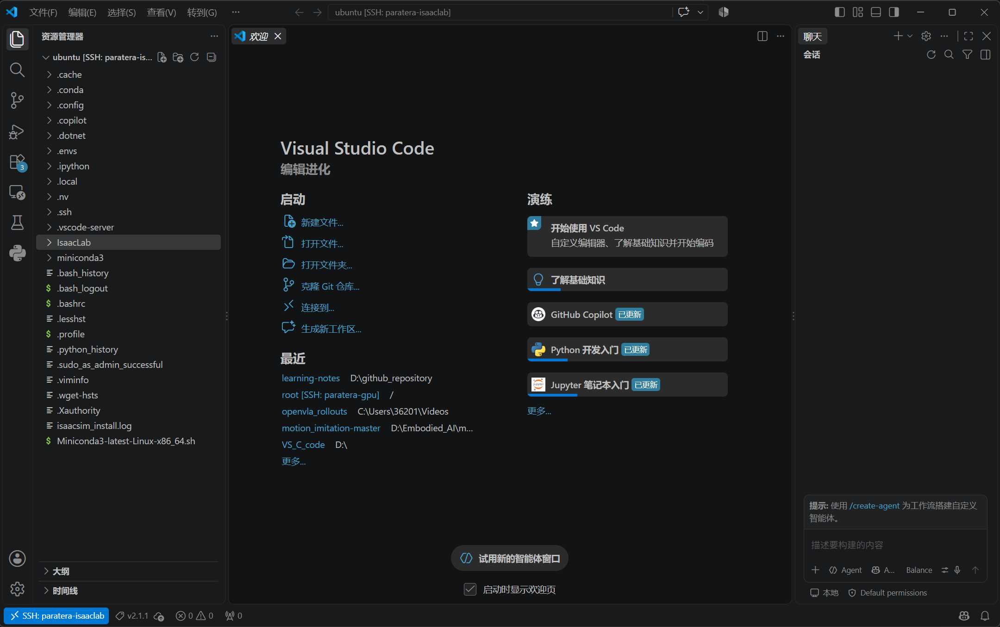

# 学习记录 2026-09-19
## 学习内容
学习如何在IssacLab仿真环境下搭建仿真环境

## 学习资料
1. https://docs.nvidia.com/learning/physical-ai/getting-started-with-isaac-lab/latest/train-your-first-robot-with-isaac-lab/


## 实验记录
1. 云服务器 4090单卡/cpu 10核/内存32GB/系统云盘100G/开发环境Jittor-Ubuntu22.04-Desktop-V3.3/带宽-按流量 100Mbps

2. 远程连接成功后，验证驱动 550.142 (≥550,Isaac Sim 5.x 和 4.5 都能装, 选更稳妥的 Isaac Sim 4.5 + Isaac Lab 2.1 组合,配系统自带 Python 3.10)
3. venv(~/.envs/isaaclab,Python 3.10.12)+ pip 清华源
4. IsaacLab v2.1.1 已克隆到 ~/IsaacLab
5. 安装Isaacsim和IsaacLab实体
6. 冒烟测试
7. 训练cartpole
8. 创建云服务器镜像
   
## 总结
环境的本质 = 六张配方表；算法的本质 = agents/ 里一个配置文件；两者的桥 = gym.register 的任务名；你的产出 = logs/ 下的 checkpoint + tensorboard 曲线 + play 评估数字。


## 仓库地图
```bash
~/IsaacLab/
├── isaaclab.sh              ← 总入口(装环境/跑脚本的包装器,本质是调 venv 的 python)
├── scripts/                 ← 【你天天打交道】顶层工具脚本
│   └── reinforcement_learning/
│       ├── rl_games/        ← train.py / play.py(训练、评估回放)
│       ├── rsl_rl/ skrl/ sb3/ ray/   ← 其他算法框架的同款 train/play
│       └── environments/    ← random_agent.py / zero_agent.py(冒烟用的就是这些)
├── source/                  ← 【框架本体,五个 Python 包】
│   ├── isaaclab/            ← 核心引擎:ManagerBasedEnv/ManagerBasedRLEnv 基类、
│   │                           场景(Scene)、传感器、MDP 算子库(mdp.*)、actuator 模型
│   ├── isaaclab_assets/     ← 【现成的资产库】50+ 机器人的预制配置:
│   │                           ANYMAL_C_CFG、FRANKA_PANDA_CFG、Unitree 系列……
│   │                           做自己环境时机器人从这里"领"现成的
│   ├── isaaclab_rl/         ← RL 接口胶水:gym 环境包装(RL-GPU 管线同步等)
│   ├── isaaclab_tasks/      ← 【所有任务环境都在这】见下面详解
│   └── isaaclab_mimic/      ← 模仿学习/遥操作相关(你用不到)
├── apps/                    ← Omniverse Kit 的启动配置(渲染选项)
├── docker/ docs/ tools/     ← 容器、文档、实用脚本(暂不用管)
└── logs/                    ← 【训练产物】跑完训练自动生成,每个算法一个子目录
```
source/isaaclab_tasks/isaaclab_tasks/manager_based/ 里按领域分:
```bash
classic/       ← Cartpole、Ant、ANYMAL Van 等经典教学任务(你的模板在这)
locomotion/    ← 四足/双足步态(ANYMAL、Go2、H1……)
manipulation/  ← 机械臂操作(抓取、PickPlace、Reach)
navigation/    ← 导航
```
核心心智模型:isaaclab 包提供“乐高积木和规则”，isaaclab_assets 提供“现成的机器人”，isaaclab_tasks 里每个文件夹是一个“用积木搭好的任务”。你做自己的环境 = 在 tasks 里新建一个文件夹。

## 理解Cartpole:一个任务 = 四件套
打开 source/isaaclab_tasks/isaaclab_tasks/manager_based/classic/cartpole/:
```bash
cartpole/
├── __init__.py            ← ① 注册( gym.register )
├── cartpole_env_cfg.py    ← ② 环境配置(观察/动作/奖励/终止 全在这)
├── cartpole.py            ← ③ 场景搭建(摆杆+小车的 USD 拼装,可被 env_cfg 覆盖)
└── agents/                ← ④ 各算法的超参
    ├── rl_games_ppo_cfg.yaml
    ├── rsl_rl_ppo_cfg.py
    ├── skrl_ppo_cfg.yaml
    └── sb3_ppo_cfg.yaml
```
1.  __init__.py —— 把任务挂到 gym 注册表
```bash
gym.register(
    id="Isaac-Cartpole-v0",                      # ← 训练时 --task 用的名字
    entry_point="isaaclab.envs:ManagerBasedRLEnv",  # ← 环境类(99% 情况不变)
    kwargs={
        "env_cfg_entry_point": "...cartpole_env_cfg:CartpoleEnvCfg",  # 环境配置类
        "rl_games_cfg_entry_point": "...agents:rl_games_ppo_cfg.yaml", # 各算法超参
        "rsl_rl_cfg_entry_point": "...", "skrl_cfg_entry_point": "...", ...
    },
)
```
train.py 的全部魔法就是:gym.make("Isaac-Cartpole-v0") → 拿到 ManagerBasedRLEnv + 配置类。你自己环境的名字就是在这里定的。

2. cartpole_env_cfg.py —— 精髓所在，ManagerBasedRLEnv 的“六件套"
Manager(管理器)范式的意思是：你不写 while 循环、不写 step 函数，只声明六张“配方表”，引擎按表执行：
配方	            里面放什么         Cartpole 里的实际内容(刚才抓的真实行)
scene	            场景里有啥	       Robot 资产(摆杆 USD)+ 地灯 + spawn 间距
actions	            智能体能干什么	   JointPositionActionCfg(控制小车左轮力矩)
observations	    看到什么	      joint_pos_rel、joint_vel_rel(杆角度、角速度、轮速)
rewards	            什么算好	      见下
terminations	    什么算完蛋	 joint_pos_out_of_manual_limit(杆倒过阈值)、time_out
events	          reset 时发生什么	   reset_joints_by_offset(随机初始姿态=域随机化)
奖励的真实写法——函数 + 权重，权重符号就是引导方向:
```bash
alive = RewTerm(func=mdp.is_alive, weight=1.0)              # 活着 +1
terminating = RewTerm(func=mdp.is_terminated, weight=-2.0)  # 倒了 -2
joint_pos_target_l2 = RewTerm(func=mdp.joint_pos_target_l2, weight=-0.01, params={...})  # 用力惩罚
```
mdp 是 isaaclab 包里的算子库(isaaclab/envs/mdp/):几十个现成的观察函数、奖励函数、终止函数。你 80% 的定制工作是“挑算子 + 调权重”，剩下 20% 才是自己写函数(自己写也只是 def my_reward(env): return xxx 然后挂进 RewTerm)。

3. 与训练脚本的关系
agents/rl_games_ppo_cfg.yaml = PPO 超参(学习率、网络结构、batch)。换算法 = 换一个 yaml,环境代码零改动。

## 搭建自己的仿真环境：最小改动清单
假设你要做一个“双臂机械臂叠积木”环境，照抄 Cartpole 五步:

1. 复制目录:cp -r classic/cartpole classic/my_stack_task,全局改名(类名、注册 id 如 Isaac-Stack-v0)
2. 换机器人:在 isaaclab_assets 里找现成配置(如 FRANKA_PANDA_CFG),替换 env_cfg 里的 robot 字段;场景没有现成 USD 的话，学 cartpole.py 用 AssetBaseCfg/RigidObjectCfg 拼基本几何体(积木 = Cuboid 即可，不一定需要美术资产)
3. 重写六件套:观察改成你要的传感器组合(关节/IMU/相机，相机用 Cartpole-RGB 那几个变体做参考)，奖励组合成你的任务目标
4. 注册:改 __init__.py 的 gym.register(注意 tasks 的总 __init__.py 里有 import 链，要让你的目录被 import 到)
5. 写超参:copy 一份 agents/rl_games_ppo_cfg.yaml 改名
调试技巧：训练前先不接 RL,单独跑环境——scripts/environments/random_agent.py --task Isaac-Stack-v0 --headless,能无报错跑起来说明六件套自洽；再写个小脚本 print observation/reward 数值验证量纲。

## 算法侧：四个框架怎么选、怎么改
框架                特点	                             适合
rl_games	官方教程默认，yaml 配置，速度快	          跟教程、快速出结果
rsl_rl	        ETH 出品，为腿足优化，极简	    locomotion 类、想吃透 PPO 源码
skrl	        纯 Python 组件化，文档好	         想改算法本身的人，首推
sb3	       Stable-Baselines3,算法最全(SAC/TD3/DQN)	  非PPO算法、对比实验
"自己的算法”两条路:

改超参/网络结构 → 只改 agents/ 里的 yaml/python 配置,零侵入;
改算法逻辑 → 选 skrl,它把 PPO 拆成可继承的组件(Sampler/Loss/...),你写个子类即可；或者最彻底的——绕开四个框架，直接 gym.make("Isaac-MyTask-v0") 拿到底层 env(env.step(action) 返回 obs/reward/done),写你自己的训练循环，把它当 extreme-SB3 用。

## 训练与评估：文件流向
1. 开训(task 换成你的):
```bash
./isaaclab.sh -p scripts/reinforcement_learning/rl_games/train.py --task Isaac-Cartpole-v0 --headless
# 常用追加: --num_envs 4096(并行环境数,4090 可拉很高) --max_iterations 300
```
产物自动落在 ~/IsaacLab/logs/rl_games/cartpole/<时间戳>/:

model_<iter>.pt —— checkpoint(评估/续训用它)
params/ —— 本次完整配置(复现的关键!)
summaries/ —— TensorBoard 数据:tensorboard --logdir logs/rl_games -p 6006 --bind_all,然后本地浏览器开 http://36.103.199.137:6006 看 reward 曲线(平台按流量计费，6006 端口走公网要确认安全组放行，不行就 scp 拉回本地看)
2. 评估：
```bash
./isaaclab.sh -p scripts/reinforcement_learning/rl_games/play.py --task Isaac-Cartpole-v0 \
  --num_envs 64 --checkpoint logs/rl_games/cartpole/<run>/model_300.pt
```

## 训练cartpole
1. 设置
RL-Games PPO,150 epochs / 976 万帧，用时不到 90 秒(10.7 万 fps),最终 mean reward 4.59(≈天花板 5.0 附近，摆杆已学会保持平衡)
2. 演示
<video controls src="cartpole_play.mp4" title="Title"></video>